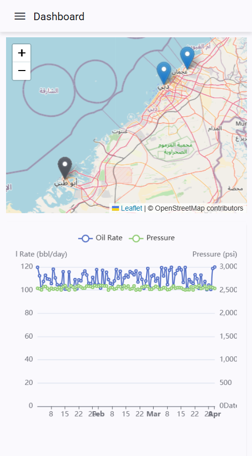

# 🛢️ Oil & Gas Analytics Platform

A comprehensive analytics platform designed to empower Oil & Gas Operators with tools to analyze and visualize Oil Production data. The platform features a **Python-based backend** and an **Angular-powered frontend**.

---

## 🖥️ Desktop and 📱 Mobile Views

### Desktop View


### Mobile Views
<div style="display: flex;">
    <!-- <div style="width: 45%; width:200px; margin-right:20px;">  -->
        <!-- <h4>📊 Dashboard</h4> -->
        
    <!-- </div> -->
    <!-- <div style="width: 45%; width:200px;"> -->
        <!-- <h4>🎛️ Filters</h4> -->
        
    <!-- </div> -->
</div>

---

## 📚 Table of Contents
1. [📖 Overview](#overview)
2. [🛠️ Technologies Used](#technologies-used)
3. [⚙️ Backend](#backend)
   - [🏗️ Architecture](#architecture)
   - [✨ Key Features](#key-features)
4. [🎨 Frontend](#frontend)
   - [🏗️ Architecture](#architecture-1)
   - [✨ Key Features](#key-features-1)
5. [🚀 Setup Instructions](#setup-instructions)
6. [🤝 Contributing](#contributing)
7. [📜 License](#license)

---

## 🛠️ Technologies Used

### Backend
- **Language**: Python 🐍
- **Framework**: FastAPI ⚡
- **Database**: PostgreSQL + TimescaleDB 🗄️

### Frontend
- **Framework**: Angular 🅰️
- **UI Library**: Angular Material 🎨
- **State Management**: NgRx 🔄
- **Charting Library**: eCharts + Angular Charts 📈
- **CSS Preprocessor**: SCSS ✂️

---

## ⚙️ Backend

### 🏗️ Architecture
The backend is structured with a modular architecture:
- **Controllers**: Manage HTTP requests and responses.
- **Services**: Contain business logic.
- **Repositories**: Handle database interactions.
- **Models**: Define database schemas.

### ✨ Key Features
- RESTful API for CRUD operations.
- PostgreSQL for well data storage.
- TimescaleDB for efficient time-series indexing.
- Robust data validation and error handling.
- Comprehensive unit and integration tests.

---

## 🎨 Frontend

### 🏗️ Architecture
The frontend leverages Angular's component-based architecture:
- **Components**: Represent UI elements.
- **Services**: Manage API communication and shared logic.
- **Modules**: Organize the app into feature-based sections.
- **State Management**: NgRx ensures predictable state handling.

### ✨ Key Features
- Global store for well / date range selection and timeseries data.
- API integration for:
  - Fetching oil production data.
  - Retrieving wells with dataset boundaries.
- Initial rendering with the first well in the database.
- Responsive, user-friendly UI.
- Dynamic visualizations with eCharts and Angular Charts.
- Form validation with real-time feedback.

---

## 🚀 Setup Instructions

### Prerequisites
- **Backend**: Python 3.8+, PostgreSQL, TimescaleDB, Docker 🐳
- **Frontend**: Node.js 14+, Angular CLI

### Steps

#### 1. Clone the Repository
```bash
git clone git@github.com:thiagotguimaraes/python-angular-ong-analytics.git
cd python-angular-ong-analytics
```

#### 2. Backend Setup
- Navigate to the backend directory:
  ```bash
  cd backend
  ```
- Install Docker Compose:
  ```bash
  sudo apt-get update
  sudo apt-get install -y docker-compose
  ```
- Configure the `.env` file:
  ```bash
  cp .env.example .env
  ```
- Start the backend services:
  ```bash
  docker-compose up -d --build
  ```
- Seed the database with mock data:
  ```bash
  bash ./seed.sh
  ```

#### 3. Frontend Setup
- Install Node.js and npm:
  ```bash
  sudo apt update
  sudo apt install nodejs npm -y
  ```
- Navigate to the frontend directory:
  ```bash
  cd frontend
  ```
- Install dependencies:
  ```bash
  npm install
  ```
- Start the development server:
  ```bash
  ng serve
  ```

#### 4. Access the Application
Visit `http://localhost:4200` in your browser. 🌐

---

## 📜 License

This project is licensed under the MIT License. See the [LICENSE](LICENSE) file for details.
